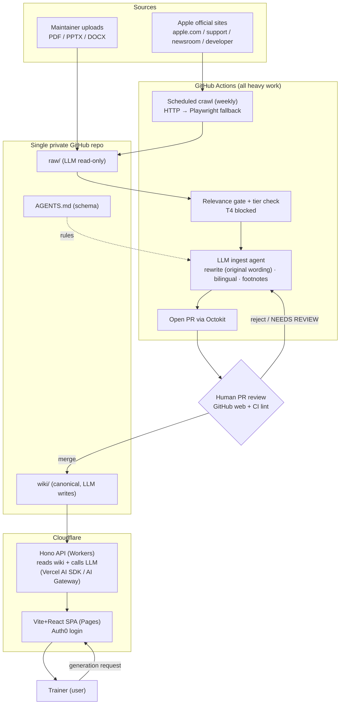
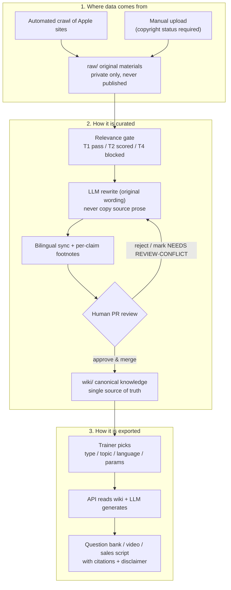

# Architecture Flow

This document shows how the Apple Training Wiki works today: how data enters,
how it is curated, and how it is turned into teaching materials. It reflects the
Markdown LLM-Wiki architecture ([ADR-023](adr/0023-architecture-re-anchoring-markdown-llm-wiki.md)),
the Cloudflare-first stack ([ADR-024](adr/0024-technology-stack-re-selection-cloudflare-first.md)),
PRD v0.3, and the wiki schema in [`/AGENTS.md`](../AGENTS.md).

Traditional Chinese: [architecture-flow.zh-TW.md](architecture-flow.zh-TW.md)

---

## 1. Development / System Flow (technical view)

How components collaborate from source to user, and where each runs.

Key points:

- The LLM can only write into the wiki through a **pull request reviewed and
  merged by a human**. It never commits to the default branch.
- All heavy work (crawl, parse, OCR, LLM rewrite) runs in **GitHub Actions**.
  Cloudflare only runs the real-time API and the front end.
- `AGENTS.md` constrains the ingest agent's behavior.

---

## 2. User-View Data Journey (in → curated → out)

The same flow from a trainer/maintainer's perspective: where wiki data comes
from, how it is curated, and how it becomes teaching material.

Key points:

- Original source material always stays in `raw/` (private). The wiki holds only
  rewritten, human-approved canonical knowledge.
- Every factual claim carries a footnote, so each output can be traced back to
  its source.
- Every export automatically includes the disclaimer from `wiki/DISCLAIMER.md`.

---

## 3. Key Invariants

These hold throughout the flow:

- Knowledge enters the wiki only via human-reviewed pull requests.
- `raw/` is LLM read-only; the LLM never edits it.
- The wiki is the single source of truth (Git Markdown); there is no separate
  database of record.
- T4 sources (leaks, rumors) are blocked at the crawl layer.
- Uncertain or conflicting content is marked `NEEDS REVIEW` / `CONFLICT` and
  routed to a human, never silently published.
- Heavy work runs in GitHub Actions; Cloudflare runs only the API and SPA.

---

## 4. Component Responsibilities

| Component | Where it runs | Responsibility |
| --- | --- | --- |
| Scheduled crawl + ingest agent | GitHub Actions | fetch, parse, OCR, relevance/tier check, LLM rewrite, open PR |
| Single private repo | GitHub | `raw/`, `wiki/`, `AGENTS.md`, `docs/`, `apps/`, config |
| Human maintainers | GitHub web | review and merge PRs |
| Hono API | Cloudflare Workers | read wiki, generators, extraction, LLM calls, auth verification |
| Front-end SPA | Cloudflare Pages | browse, generator UI, upload, Auth0 login |
| LLM | via Vercel AI SDK / Cloudflare AI Gateway | ingest rewrite + output generation (switchable provider) |
