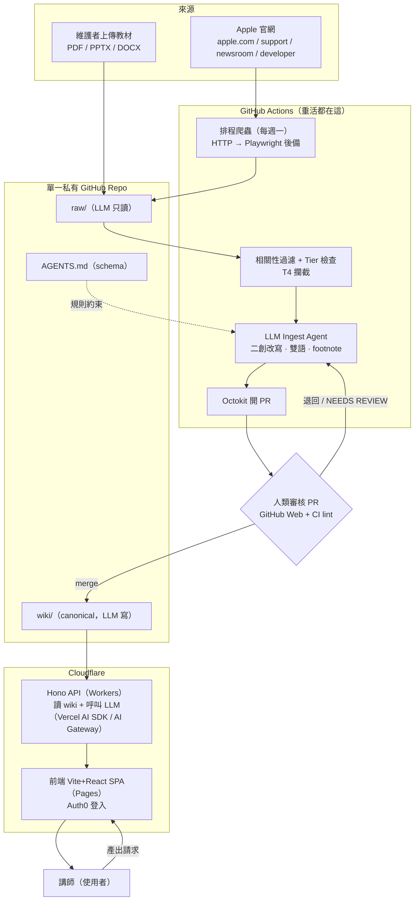
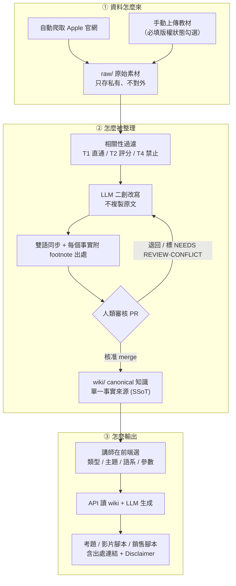

# Architecture Flow（架構流程）

本文件說明 Apple Training Wiki 目前的運作方式：資料怎麼進來、怎麼被整理、最後怎麼
變成教學素材。內容對齊 Markdown LLM-Wiki 架構
（[ADR-023](adr/0023-architecture-re-anchoring-markdown-llm-wiki.zh-TW.md)）、
Cloudflare-first 技術棧
（[ADR-024](adr/0024-technology-stack-re-selection-cloudflare-first.zh-TW.md)）、
PRD v0.3，以及 repo 根的 wiki schema [`/AGENTS.md`](../AGENTS.md)。

English: [architecture-flow.md](architecture-flow.md)

---

## 1. 開發 / 系統運作流程（技術視角）

從來源到使用者，各元件怎麼協作、誰在哪裡執行。

重點：

- LLM 只能透過 **PR + 人類審核**寫進 wiki，不會直接 commit 到主分支。
- 重活（爬蟲、解析、OCR、LLM 改寫）都在 **GitHub Actions**；Cloudflare 只跑即時
  API 與前端。
- `AGENTS.md` 約束 ingest agent 的行為。

---

## 2. 使用者視角的資料旅程（來 → 整理 → 輸出）

同一條流程，從講師/維護者角度看：wiki 裡的資料怎麼來、怎麼被整理、最後怎麼變成教材。

重點：

- 原始素材永遠留在 `raw/`（私有）；wiki 只放二創後、經人類核准的 canonical 知識。
- 每筆事實主張都附 footnote，因此每個輸出都能沿出處追回來源。
- 每個輸出自動帶上 `wiki/DISCLAIMER.md` 的免責聲明。

---

## 3. 關鍵不變量

整條流程都遵守：

- 知識只能透過人類審核的 pull request 進入 wiki。
- `raw/` 對 LLM 唯讀；LLM 不編輯它。
- wiki 是單一事實來源（Git Markdown）；沒有另一個資料庫真相來源。
- T4 來源（爆料、傳聞）在爬蟲層被攔截。
- 存疑或衝突內容標 `NEEDS REVIEW` / `CONFLICT` 交人類，不會悄悄發布。
- 重活在 GitHub Actions；Cloudflare 只跑 API 與 SPA。

---

## 4. 元件職責對照

| 元件 | 在哪執行 | 職責 |
| --- | --- | --- |
| 排程爬蟲 + ingest agent | GitHub Actions | 抓取、解析、OCR、相關性/tier 檢查、LLM 改寫、開 PR |
| 單一私有 repo | GitHub | `raw/`、`wiki/`、`AGENTS.md`、`docs/`、`apps/`、設定 |
| 人類維護者 | GitHub Web | 審核並合併 PR |
| Hono API | Cloudflare Workers | 讀 wiki、產出器、提取、LLM 呼叫、認證驗證 |
| 前端 SPA | Cloudflare Pages | 瀏覽、產出工具 UI、上傳、Auth0 登入 |
| LLM | 經 Vercel AI SDK / Cloudflare AI Gateway | ingest 改寫 + 輸出生成（provider 可切換） |
